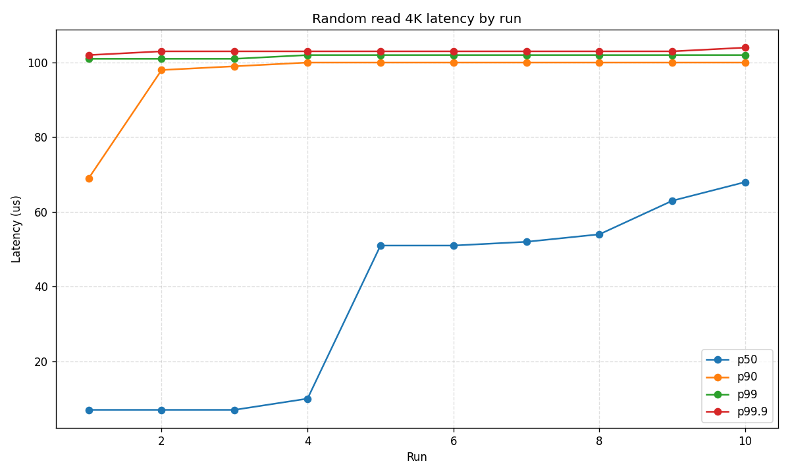
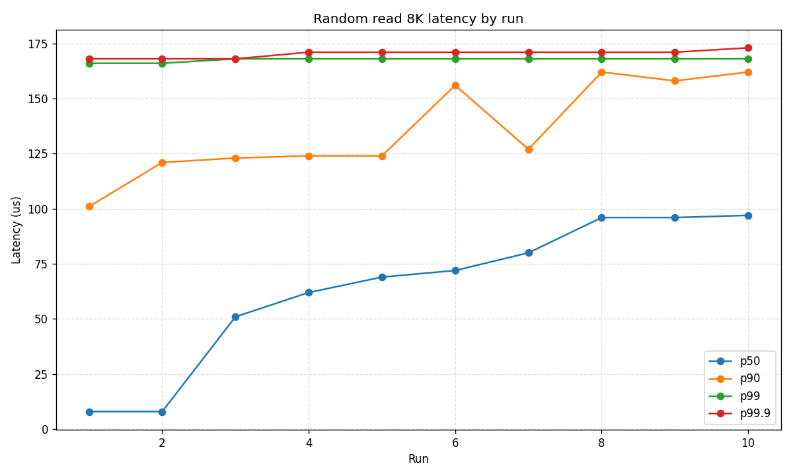
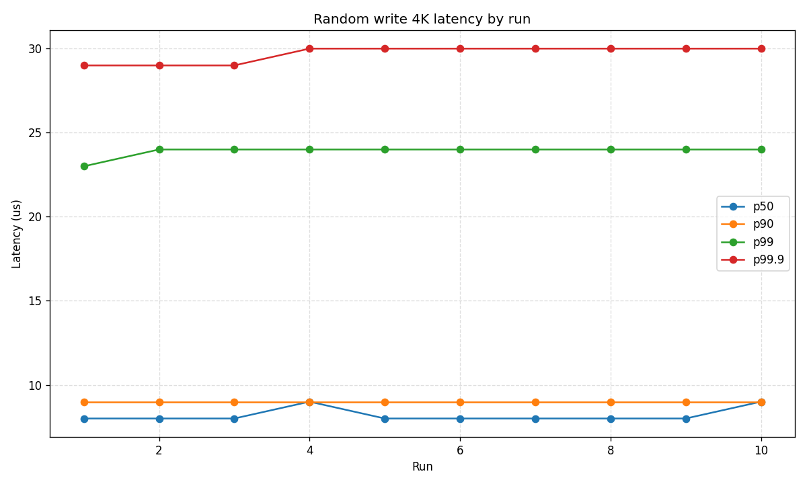
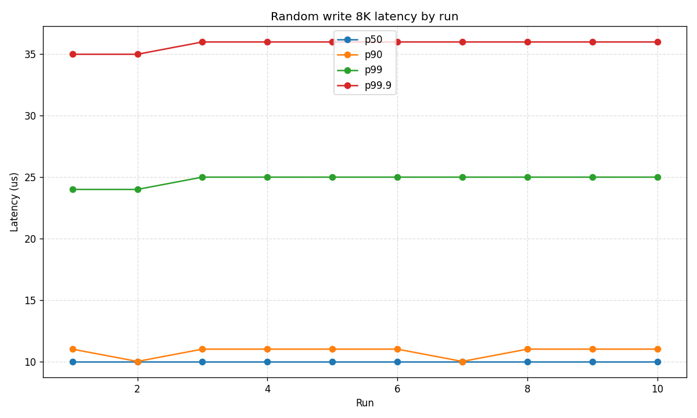

# NVMe performance measurements

This folder contains the scripts to run the NVMe oriented performance tests.

## Table of Contents

- [fio_device.sh](#fio_devicesh)
- [fill_disk.sh](#fill_disksh)
- [aio vs. uring](#aio-vs-uring)

## fio_device.sh

This script runs a number of fio tests on a single device. Device must be unmounted before running the script.

We measure:
1. Sequential throughput: read/write 1M at QD64.
2. Random IOPS: read/write 4K and 8K at QD256.
3. Random latency: read/write 4K and 8K at QD1.

The test suite is repeated multiple times (`--run-count`) and variance is calculated across runs.

Note, `blkdiscard` is applied only once before the run loop, so read latency can drift between runs; reported latencies are taken from the median run.

### Example

Running on INTEL SSDPE2KE032T8 NVMe:
```
./fio_device.sh --filename /dev/nvme3n1p2 --results-dir ~/fio_device_logs/fio_device_nvme3/ [--run-count 10]
```

Output example:
```
THROUGHPUT SUMMARY
Operation                  QD    BW, MiB/s     IOPS (K)     p50 us     p90 us     p95 us     p99 us   p99.9 us
--------------------------------------------------------------------------------------------------------------
Random read 4K            256         1708          437         67        489        503        544        630
--------------------------------------------------------------------------------------------------------------
Random write 4K           256         1699          435         24        407        552        561        577
--------------------------------------------------------------------------------------------------------------
Random read 8K            256         2999          383        284        518        548        749        941
--------------------------------------------------------------------------------------------------------------
Random write 8K           256         2749          351        354       1187       1376       1883       2244
--------------------------------------------------------------------------------------------------------------
Read 1M                    64         3223            3      19791      20316      20578      20971      22675
--------------------------------------------------------------------------------------------------------------
Write 1M                   64         2855            2      21889      24510      25952      27394      28573

LATENCY SUMMARY
Operation                  QD    BW, MiB/s     IOPS (K)     p50 us     p90 us     p95 us     p99 us   p99.9 us
--------------------------------------------------------------------------------------------------------------
Random read 4K              1           79           20         51        100        101        102        103
--------------------------------------------------------------------------------------------------------------
Random write 4K             1          353           90          8          9          9         24         30
--------------------------------------------------------------------------------------------------------------
Random read 8K              1          105           13         70        125        165        168        171
--------------------------------------------------------------------------------------------------------------
Random write 8K             1          610           78         10         11         13         25         36

LATENCY RUNS DETAIL
   Run Operation                QD    BW, MiB/s     IOPS (K)     p50 us     p90 us     p95 us     p99 us   p99.9 us
# Random read 4K
-------------------------------------------------------------------------------------------------------------------
     1 Random read 4K            1          172           44          7         69         99        101        102
-------------------------------------------------------------------------------------------------------------------
     2 Random read 4K            1          129           33          7         98        100        101        103
-------------------------------------------------------------------------------------------------------------------
     3 Random read 4K            1          106           27          7         99        100        101        103
-------------------------------------------------------------------------------------------------------------------
     4 Random read 4K            1           92           23         10        100        100        102        103
-------------------------------------------------------------------------------------------------------------------
     5 Random read 4K            1           83           21         51        100        101        102        103
-------------------------------------------------------------------------------------------------------------------
     6 Random read 4K            1           76           19         51        100        101        102        103
-------------------------------------------------------------------------------------------------------------------
     7 Random read 4K            1           71           18         52        100        101        102        103
-------------------------------------------------------------------------------------------------------------------
     8 Random read 4K            1           68           17         54        100        101        102        103
-------------------------------------------------------------------------------------------------------------------
     9 Random read 4K            1           65           16         63        100        101        102        103
-------------------------------------------------------------------------------------------------------------------
    10 Random read 4K            1           62           16         68        100        101        102        104

# Random read 8K
-------------------------------------------------------------------------------------------------------------------
     1 Random read 8K            1          232           29          8        101        124        166        168
-------------------------------------------------------------------------------------------------------------------
     2 Random read 8K            1          171           21          8        121        160        166        168
-------------------------------------------------------------------------------------------------------------------
     3 Random read 8K            1          138           17         51        123        164        168        168
-------------------------------------------------------------------------------------------------------------------
     4 Random read 8K            1          120           15         62        124        164        168        171
-------------------------------------------------------------------------------------------------------------------
     5 Random read 8K            1          110           14         69        124        164        168        171
-------------------------------------------------------------------------------------------------------------------
     6 Random read 8K            1          101           12         72        156        166        168        171
-------------------------------------------------------------------------------------------------------------------
     7 Random read 8K            1           96           12         80        127        166        168        171
-------------------------------------------------------------------------------------------------------------------
     8 Random read 8K            1           90           11         96        162        166        168        171
-------------------------------------------------------------------------------------------------------------------
     9 Random read 8K            1           89           11         96        158        166        168        171
-------------------------------------------------------------------------------------------------------------------
    10 Random read 8K            1           85           11         97        162        166        168        173

# Random write 4K
-------------------------------------------------------------------------------------------------------------------
     1 Random write 4K           1          353           90          8          9          9         23         29
-------------------------------------------------------------------------------------------------------------------
     2 Random write 4K           1          352           90          8          9          9         24         29
-------------------------------------------------------------------------------------------------------------------
     3 Random write 4K           1          352           90          8          9          9         24         29
-------------------------------------------------------------------------------------------------------------------
     4 Random write 4K           1          353           90          9          9          9         24         30
-------------------------------------------------------------------------------------------------------------------
     5 Random write 4K           1          353           90          8          9          9         24         30
-------------------------------------------------------------------------------------------------------------------
     6 Random write 4K           1          353           90          8          9          9         24         30
-------------------------------------------------------------------------------------------------------------------
     7 Random write 4K           1          352           90          8          9          9         24         30
-------------------------------------------------------------------------------------------------------------------
     8 Random write 4K           1          354           90          8          9          9         24         30
-------------------------------------------------------------------------------------------------------------------
     9 Random write 4K           1          353           90          8          9          9         24         30
-------------------------------------------------------------------------------------------------------------------
    10 Random write 4K           1          354           90          9          9          9         24         30

# Random write 8K
-------------------------------------------------------------------------------------------------------------------
     1 Random write 8K           1          611           78         10         11         13         24         35
-------------------------------------------------------------------------------------------------------------------
     2 Random write 8K           1          613           78         10         10         13         24         35
-------------------------------------------------------------------------------------------------------------------
     3 Random write 8K           1          611           78         10         11         13         25         36
-------------------------------------------------------------------------------------------------------------------
     4 Random write 8K           1          610           78         10         11         13         25         36
-------------------------------------------------------------------------------------------------------------------
     5 Random write 8K           1          608           77         10         11         13         25         36
-------------------------------------------------------------------------------------------------------------------
     6 Random write 8K           1          610           78         10         11         13         25         36
-------------------------------------------------------------------------------------------------------------------
     7 Random write 8K           1          611           78         10         10         13         25         36
-------------------------------------------------------------------------------------------------------------------
     8 Random write 8K           1          607           77         10         11         14         25         36
-------------------------------------------------------------------------------------------------------------------
     9 Random write 8K           1          610           78         10         11         13         25         36
-------------------------------------------------------------------------------------------------------------------
    10 Random write 8K           1          608           77         10         11         13         25         36

THROUGHPUT RUNS VARIANCE
Operation                QD     BW min     BW max    BW median  BW stddev
-------------------------------------------------------------------------
Random read 4K          256       1689       1737         1708      15.07
-------------------------------------------------------------------------
Random write 4K         256       1683       1703         1699       6.09
-------------------------------------------------------------------------
Random read 8K          256       2988       3038         2999      16.55
-------------------------------------------------------------------------
Random write 8K         256       2712       2771         2749      14.53
-------------------------------------------------------------------------
Read 1M                  64       3174       3223         3223      15.93
-------------------------------------------------------------------------
Write 1M                 64       2833       2887         2855      18.34

LATENCY RUNS VARIANCE
Operation                QD     BW min     BW max    BW median  BW stddev
-------------------------------------------------------------------------
Random read 4K            1         62        172           79      33.09
-------------------------------------------------------------------------
Random write 4K           1        352        354          353       0.70
-------------------------------------------------------------------------
Random read 8K            1         85        232          105      44.15
-------------------------------------------------------------------------
Random write 8K           1        607        613          610       1.70
```

To plot:
```
python3.10 ./aggregate.py ~/fio_device_logs/fio_device_nvme3/ --plot --prefix fio_device_latency
```





## fill_disk.sh

Preconditions a disk target (or selected `--size-percent`) with sequential fill plus optional random-write runs.
For block devices it applies `blkdiscard` first and prints probe latency/bandwidth summaries between stages.

In other words, it runs the following:
1. `blkdiscard` once (block devices only).
2. Short initial random-write probe (`4K`, `iodepth=32`).
3. Sequential fill (`1M`) over `--size-percent` of the target.
4. Repeat `--rand-run-count` times: random preconditioning (`8K`) + short probe for each repetition.

It can also be used as a standalone benchmark together with an external disk metrics collector. In particular, after filling an NVMe device and then running random writes, you may observe a dramatic performance drop, as shown below:


## aio vs. uring

See [aio_vs_uring/README.md](aio_vs_uring/README.md) for details.

