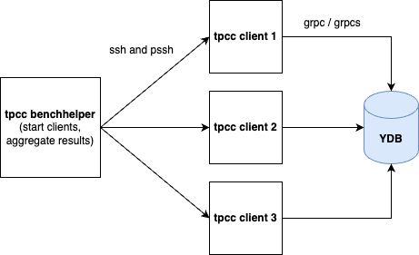

# How to run TPC-C on YDB

Until you have a cluster of a reasonable size, you can easily run a single instance of [TPC-C](https://github.com/ydb-platform/tpcc). Current implementation of TPC-C is relatively [resource](https://github.com/ydb-platform/tpcc#hardware-requirements) greedy, which is why you might need to start multiple instances of TPC-C on different machines, when your YDB cluster contains hundreds of cores. For this purpose we provide `run_ydb.sh`, a tpcc benchhelper, which helps to start the TPC-C instances as well as to aggregate the results.

Also this directory contains some additional scripts to help you with TPC-C installation, ssh keys configuration, etc.

## Prerequisites

<center></center>

The TPC-C setup involves the following components:
1. `run_ydb.sh` tpcc benchhelper and its dependencies located in its directory. Execute it on any random machine.
2. TPC-C clients, which can be executed on the same machine as the `run_ydb.sh`. However, for a reasonable YDB cluster, it is recommended to have multiple machines running the TPC-C clients. Please, check hardware [requirements](https://github.com/ydb-platform/tpcc#hardware-requirements) for TPC-C clients.
3. A running YDB cluster. While it can be on the same machines where the TPC-C client is executed, we strongly advise having separate machines for the YDB cluster.
4. Prepared file containing a list of TPC-C hosts (separated by new lines) to run the TPC-C client on. Note that if your machine has multiple cores, you can run multiple instances of TPC-C on the same machine. For example:

```
cat << EOF > tpcc.hosts
machine1.com
machine1.com
machine2.com
machine2.com
EOF
```

For a regular installation to install all the dependencies and TPC-C (except Java 21), you can use the following command:
```
./setup_tpcc_nodes.sh --hosts tpcc.hosts
exec -l $SHELL
```

Currently `setup_tpcc_nodes.sh` supports Ubuntu only. That is why it might fail to install some dependencies. Until the end of this section we provide a detailed description of the prerequisites and how to install them manually.

Prerequisites to run `run_ydb.sh` tpcc benchhelper script:
1. Install pssh.
2. Install the `ydb`,`ydb[yc]`, `numpy` and `requests` Python packages using `pip3 install ydb numpy requests ydb[yc]`.
3. [Download](https://ydb.tech/en/docs/downloads/) the latest YDB CLI and place it somewhere in your PATH.
4. To generate (if needed) and save your SSH keys:
```
../../common/copy_ssh_keys.sh --hosts tpcc.hosts
exec -l $SHELL
```

Prerequisites to run TPC-C client:
1. Install Java 21 (note, that the scripts updates `/usr/local/bin/java` symlink). Should be used only for testing purposes. You can use `../../common/install_java21.sh --hosts tpcc.hosts`
2. Install YDB's [TPC-C](https://github.com/ydb-platform/tpcc) into your home folder on each machine.
You have two options: build it on your own or use the prebuilt package. Here you can find prebuilt [benchbase-ydb.tgz](https://storage.yandexcloud.net/ydb-benchmark-builds/benchbase-ydb.tgz).

To install the package, execute the following (note, that if you don't specify the package, the script will download the latest from the internet):
```
./upload_benchbase.sh --hosts tpcc.hosts [--package benchbase-ydb.tgz]
```

### Authentication

There are various [authentication](https://github.com/ydb-platform/ydb-jdbc-driver/#authentication-modes) modes.

#### Anonymous auth (default)

You don't have to do anything.

#### Access token

Run `run_ydb.sh` with `--token-file /PATH/ydb_token_file` argument. Please, note that this token file will be copied to the machines listed in `tpcc.hosts` file.

#### Service Account Key

Run `run_ydb.sh` with `--sa-key-file /PATH/sa_key_file`. Please, note that service account key will be copied to the machines listed in `tpcc.hosts` file.

#### Using secure connection (grpcs) and CA certificate

Run `run_ydb.sh` with `--ca-file /PATH/ca.crt --secure`. Please, note that `ca.crt` will be copied to the machines listed in `tpcc.hosts` file.

#### Static credentials

Export `YDB_USER` and `YDB_PASSWORD` variables, before running the `run_ydb.sh`. Note, that their values will be saved in config for TPC-C and this config is uploaded to the machines listed in `tpcc.hosts` file.

## Running the benchmark

To run the benchmark, execute the following command:

```
mkdir -p $HOME/tpcc_logs
./run_ydb.sh                                        \
    --ydb-host ydb-001.com                          \
    --database /Root/testdb                         \
    --config tpcc_config_template.xml               \
    --hosts tpcc.hosts                              \
    --warehouses 1000                               \
    --warmup 1200                                   \
    --time 3600                                     \
    --java-memory <ACCORDING_HARDWARE_REQUIREMENTS> \
    --log-dir $HOME/tpcc_logs
```

Note, that warmup and time are in seconds. By default the benchmark uses just 16 loader threads, if your machines have enough cores (as well as YDB cluster), you can increase the number of threads using the `--loader-threads` flag. In our runs we usually use 128 threads per machine (1 thread per core) and 8 machines to run the benchmark (YDB cluster has 384 cores in total).

If you have already executed the benchmark, you can use the `--run-phase-only` flag to reuse existing data and skip the loading phase. This will save you time on data generation. Also just to load the data and skip the execution, use the `--no-run` flag. Usually it is convinient to load the data, check the monitoring metrics and then run the benchmark.

## TPC-C client metrics

To collect metrics from TPC-C instances add the following to the `tpcc_config_template.xml`:
```xml
    <monitoringPort>{mport}</monitoringPort>
    <monitoringName>{mname}</monitoringName>
```